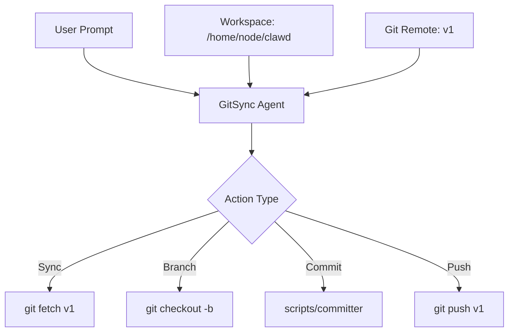

# Clawdbot Automated Git Sync Agent Plan

## Overview

Create a new clawdbot agent that can automatically:

1. Sync changes from the v1 repository
2. Create new branches for changes
3. Commit changes with proper messages
4. Push to the new origin

## Architecture



## Plan

### Step 1: Add GitSync Agent to clawdbot.json

Add a new agent configuration that has:

- Workspace pointing to the clawdbot project
- Access to git tools
- Proper permissions for push operations

### Step 2: Configure Git Remotes

The `v1` remote is already set up:

- `v1` → https://github.com/Wonder-clawdbot/clawdbot-v1.git

### Step 3: Create Agent Prompt Template

Provide a ready-to-use prompt that the user can give to the agent.

### Step 4: Test the Workflow

Verify the agent can:

1. Fetch latest changes
2. Create branches
3. Commit files
4. Push to v1 remote

## Implementation Details

### Agent Configuration

```json
{
  "agents": {
    "list": [
      {
        "id": "gitsync",
        "workspace": "/home/node/clawd",
        "identity": {
          "name": "GitSync Bot",
          "theme": "Automated git workflow assistant. Creates branches, commits changes, and pushes to v1 remote. Expert in git commands and GitHub workflows.",
          "emoji": "🔄"
        },
        "sandbox": {
          "mode": "off"
        }
      }
    ]
  }
}
```

### Prompt Template for User

```
You are the GitSync Bot for clawdbot project.

Repository: /home/node/clawd
Git Remote: v1 → https://github.com/Wonder-clawdbot/clawdbot-v1.git

Your workflow:
1. When asked to sync: Run `git fetch v1` and `git merge v1/main`
2. When asked to create a branch: Run `git checkout -b <branch-name>`
3. When asked to commit: Use `scripts/committer "message" <files...>`
4. When asked to push: Run `git push v1 <branch-name>`

Rules:
- Always use the v1 remote for push operations
- Use descriptive commit messages
- Create feature branches for new changes
- Sync main branch before creating new branches
```

## Files to Modify

1. `~/.clawdbot/clawdbot.json` - Add gitsync agent configuration
2. Update remote configuration if needed

## Commands Reference

| Action        | Command                                   |
| ------------- | ----------------------------------------- |
| Fetch v1      | `git fetch v1`                            |
| Sync main     | `git merge v1/main`                       |
| Create branch | `git checkout -b feature-name`            |
| Commit        | `scripts/committer "message" file1 file2` |
| Push          | `git push v1 branch-name`                 |

## Next Steps

1. Add the gitsync agent to clawdbot.json
2. Provide the prompt to the user
3. Test the workflow with a simple change
