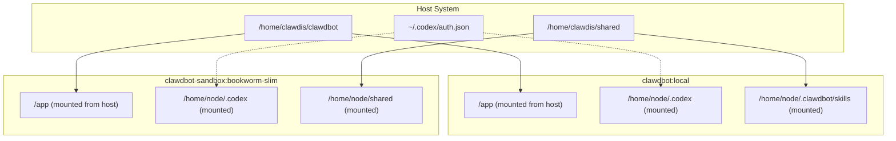

# Sandbox Configuration Plan - Final

## Summary of Issues to Fix

1. **Q1: Persistent Tools** - Bot can edit Dockerfiles in clawdbot project, create branches for changes
2. **Q2: Codex CLI with OAuth** - Mount host's `.codex/auth.json` to containers (hidden from agent)
3. **Q3: Network Access** - Bridge mode (recommended for security + functionality)
4. **Q4: Skills + Codex** - Share skills folder, install Codex CLI in both containers

---

## Architecture Overview



---

## Q1: Bot Access to Dockerfiles (Git Branch Workflow)

### Approach: Bot edits clawdbot project directly, creates branches

**Files to modify:**

- `Dockerfile` - Main container
- `Dockerfile.sandbox` - Sandbox container
- `docker-compose.yml` - Service definitions

**Bot workflow for adding new tools:**

1. Bot creates a new git branch: `sandbox-update-{timestamp}`
2. Bot edits `Dockerfile.sandbox` to add new tools
3. Bot commits changes: `Sandbox: add {new tool}`
4. Human reviews and merges to main (or bot can auto-merge for dev)

**To make this work:**

```bash
# Ensure bot has write access to clawdbot repo
# Already has GITHUB_TOKEN from config
```

**Alternative (simpler):** Just edit files directly on the host where clawdbot is installed

---

## Q2: Codex CLI with OAuth (Hidden from Agent)

### Approach: Mount host's Codex auth file as read-only

**Codex auth file location:** `~/.codex/auth.json`

**In `clawdbot.json.new`:**

```json
{
  "agents": {
    "defaults": {
      "sandbox": {
        "docker": {
          "binds": [
            "/home/clawdis/shared:/home/node/shared:rw",
            "/home/clawdis/clawd:/home/node/clawd:ro",
            "/home/clawdis/clawd-team:/home/node/clawd-team:ro",
            "/home/clawdis/.codex/auth.json:/home/node/.codex/auth.json:ro",
            "/home/clawdis/shared/skills:/home/node/.clawdbot/skills:ro"
          ]
        }
      }
    }
  }
}
```

**For main container in `docker-compose.yml`:**

```yaml
volumes:
  - /home/clawdis/.codex/auth.json:/home/node/.codex/auth.json:ro
  - /home/clawdis/shared/skills:/home/node/.clawdbot/skills:ro
```

**Benefits:**

- Agent cannot see/edit the OAuth tokens (read-only mount)
- Tokens persist across container rebuilds
- Same tokens used in both containers

---

## Q3: Network Access (Bridge Mode - Recommended)

### Approach: Use Docker bridge with NAT (recommended for security)

**In `clawdbot.json.new`:**

```json
{
  "agents": {
    "defaults": {
      "sandbox": {
        "docker": {
          "network": "bridge"
        }
      }
    }
  }
}
```

**For main container in `docker-compose.yml`:**

```yaml
services:
  clawdbot-gateway:
    network_mode: bridge # Add this
    # ... rest of config

  clawdbot-cli:
    network_mode: bridge # Add this
    # ... rest of config
```

**Why Bridge Mode?**
| Feature | bridge | host | none |
|---------|--------|------|------|
| Internet access | ✅ | ✅ | ❌ |
| Host network access | ❌ | ✅ | ❌ |
| Security isolation | ✅ Medium | ❌ Low | ✅ High |
| Port publishing | ✅ | N/A | ❌ |

**Bridge is recommended** because:

- Still has full internet access
- Better security isolation than host mode
- Port publishing works for browser tools
- Tools/skills requiring network work fine

---

## Q4: Skills Sharing + Codex CLI

### In `Dockerfile.sandbox`:

```dockerfile
FROM node:22-bookworm-slim

ENV DEBIAN_FRONTEND=noninteractive

RUN apt-get update \
  && apt-get install -y --no-install-recommends \
    bash \
    ca-certificates \
    curl \
    git \
    jq \
    python3 \
    ripgrep \
    unzip \
    wget \
    zip \
  && corepack enable \
  && corepack prepare pnpm@latest --activate \
  && rm -rf /var/lib/apt/lists/*

# Install Codex CLI
RUN pnpm add -g @openai/codex

# Add to PATH
ENV PATH="/home/node/.local/bin:${PATH}"

# Create skills directory
RUN mkdir -p /home/node/.clawdbot/skills

CMD ["sleep", "infinity"]
```

### Skills Mounting

**In `docker-compose.yml`:**

```yaml
volumes:
  - /home/clawdis/shared/skills:/home/node/.clawdbot/skills:ro
```

**In `clawbot.json.new` for sandbox:**

```json
{
  "agents": {
    "defaults": {
      "sandbox": {
        "docker": {
          "binds": [
            "/home/clawdis/shared/skills:/home/node/.clawdbot/skills:ro"
          ]
        }
      }
    }
  }
}
```

---

## Implementation Steps

### Step 1: Update `Dockerfile.sandbox`

```dockerfile
FROM node:22-bookworm-slim

ENV DEBIAN_FRONTEND=noninteractive

RUN apt-get update \
  && apt-get install -y --no-install-recommends \
    bash \
    ca-certificates \
    curl \
    git \
    jq \
    python3 \
    ripgrep \
    unzip \
    wget \
    zip \
  && corepack enable \
  && corepack prepare pnpm@latest --activate \
  && rm -rf /var/lib/apt/lists/*

# Install Codex CLI
RUN pnpm add -g @openai/codex

# Add to PATH
ENV PATH="/home/node/.local/bin:${PATH}"

# Create directories for mounts
RUN mkdir -p /home/node/.clawdbot/skills /home/node/.codex /home/node/shared

CMD ["sleep", "infinity"]
```

### Step 2: Update `clawdbot.json.new`

Add volume mounts and network config:

```json
{
  "agents": {
    "defaults": {
      "sandbox": {
        "mode": "all",
        "docker": {
          "network": "bridge",
          "binds": [
            "/home/clawdis/shared:/home/node/shared:rw",
            "/home/clawdis/clawd:/home/node/clawd:ro",
            "/home/clawdis/clawd-team:/home/node/clawd-team:ro",
            "/home/clawdis/.codex/auth.json:/home/node/.codex/auth.json:ro",
            "/home/clawdis/shared/skills:/home/node/.clawdbot/skills:ro"
          ]
        }
      }
    }
  }
}
```

### Step 3: Update `docker-compose.yml`

```yaml
services:
  clawdbot-gateway:
    network_mode: bridge
    volumes:
      - /home/clawdis/.codex/auth.json:/home/node/.codex/auth.json:ro
      - /home/clawdis/shared/skills:/home/node/.clawdbot/skills:ro
      # ... existing volumes

  clawdbot-cli:
    network_mode: bridge
    volumes:
      - /home/clawdis/.codex/auth.json:/home/node/.codex/auth.json:ro
      # ... existing volumes
```

### Step 4: Build and Deploy

```bash
# Rebuild main image
docker build -t clawdbot:local .

# Rebuild sandbox image
docker build -f Dockerfile.sandbox -t clawdbot-sandbox:bookworm-slim .

# Recreate containers
clawdbot sandbox recreate --all

# Restart services
docker-compose down && docker-compose up -d
```

---

## Verification Steps

1. **Check Codex access:**

   ```bash
   docker exec -it clawdbot-gateway codex --version
   docker exec -it clawdbot-sandbox-xxx codex --version
   ```

2. **Check network connectivity:**

   ```bash
   docker exec -it clawdbot-gateway curl -I https://api.openai.com
   ```

3. **Check skills mounted:**

   ```bash
   docker exec -it clawdbot-sandbox-xxx ls -la /home/node/.clawdbot/skills/
   ```

4. **Check Codex OAuth:**
   ```bash
   docker exec -it clawdbot-gateway cat /home/node/.codex/auth.json
   # Should show tokens, but agent can't write to it (read-only)
   ```
